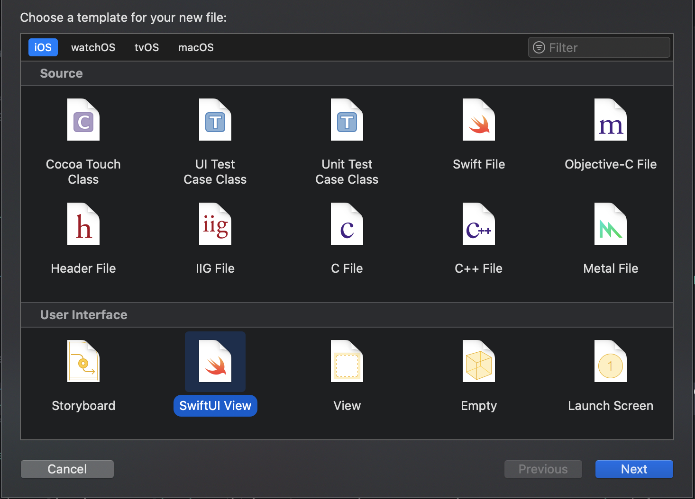
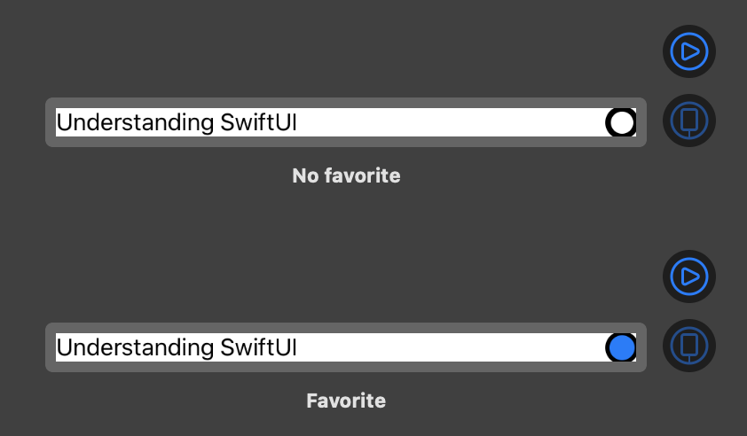
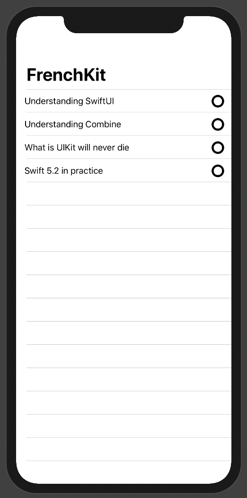
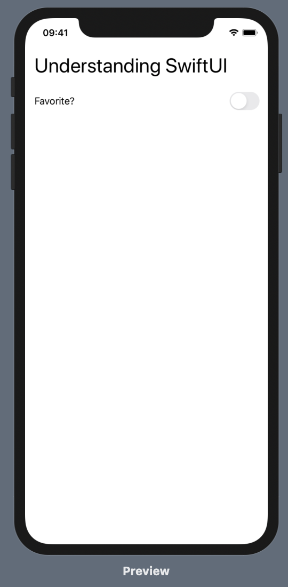

# HandsOn SwiftUI
SwiftUI, c'est le nouveau SDK pour développer des apps cross-plateform dans l'éco-système Apple.

Il repose sur deux notions que nous allons voir à travers ce TP :
1. La programmation déclarative : pas de XML, JSX, storyboard... tout est code !
2. La programmation réactive pour la gestion d'état et du "DOM".

## Useful Shortcuts
* `Command + Option + Enter` - Toggle Live Preview
* `Command + Option + P` - Resume Live Preview
* `Command + Shift + L` - Quick Insert
* `Command + click on Code` - Open SwiftUI actions

## Exercice 1 - SwiftUI : le premier contact

  > Le but de l'exercice est d'apprendre à créer une nouvelle `View` sur `Xcode`.

1. Créez un nouvelle `View` appelée `TalkRow` dans `Xcode`

Choisissez sur le menu en haut `File > New > File...` et `SwiftUI View` comme dans l'image pour créer le fichier.

&nbsp;

Vous remarquez que `TalkRow` implémente le protocole `View`. C'est le type "primitif" de SwiftUI : tous les éléments visuels sont de type `View`. La mise en forme d'une `View` se définit dans sa propriété `body` à base... de `View` !.

2. Passez un `Talk` en paramètre de `TalkRow`.
3. Affichez le titre du `Talk`, suivi par un indicateur de l'état `isFavorite`.
4. L'indicateur devra être un cercle avec un bord noir.
5. Le cercle aura un remplissage de couleur bleu si le `Talk` est favori, et vide autrement.

> 
>
> `TalkRow` pour un talk non favori

> 
>
> `TalkRow` pour un talk favori

Pour réaliser un cercle ayant un bord et un remplissage, vous pourrez utiliser, par exemple, un `ZStack`.

### Composants SwiftUI à utiliser dans cet exercice

- `Circle`
- `HStack`
- `ZStack`
- `Spacer`
- `if`

### QUIZZ

1. Combien de root view `body` peut-il contenir ?
2. Comment passe-t-on des données à une `View` ?

## Exercice 2 - Preview

  > Vous allez découvrir comment avoir un aperçu rapide des états des vos `View`s.

Modifiez `TalkRow_Previews` pour afficher les deux états de la vue `TalkRow`. Vous pourrez également changer le libellé des _Previews_ affichées. Le résultat devra ressembler à celui-ci :

> 

### Composants SwiftUI à utiliser dans cet exercice

- `Group`

## Exercice 3 - `List` et `NavigationView`

  > Cet exercice a pour but d'afficher les `TalkRow` à l'intérieur d'une liste.

1. Créez une nouvelle View `TalkList` prenant en input un array de `Talk`
2. Ajoutez une liste contenant des Views `TalkRow`
3. Si tout fonctionne, il est temps d'ajouter une `NavigationView` contenant la `List` que vous venez de créer.
4. (Bonus) Ajoutez un titre (par ex. _FrenchKit_) en haut de la page.

Vous devriez arriver au résultat suivant :

> 

### Composants SwiftUI à utiliser dans cet exercice

- `NavigationView`
- `List`

### QUIZZ

1. Quel est le meilleur endroit pour insérer la ligne permettant d'afficher le titre de la `NavigationView` ? Pourquoi ?
2. (Bonus) Comment itère-t-on sur une liste d'éléments ? Pouvons-nous nous passer du paramètre `id` dans le constructeur de `List` ? Comment ?

## Exercice 4 - Navigation !

  > Le but de l'exercice est d'être capable de naviguer de la liste à une page de détail.

1. Créez une nouvelle `View` appelée `TalkDetail` pouvant s'initialiser avec un `Talk`
2. Dans `TalkDetail`, affichez le titre du `Talk` et un composant Switch (qui s'appelle désormais `Toggle`). Le paramètre `isOn` du Toggle sera (pour l'instant) à remplir avec une valeur de stub `.constant(true)` (nous terminerons l'implémentation au cours du prochain exercice).

Vous devriez arriver au résultat suivant :

> 

3. Créez une navigation permettant d'ouvrir la page `TalkDetail` depuis `TalkList`.

> Vous pouvez tester la navigation depuis la Preview. Il faut juste rentrer en mode *Live Preview* (voir image ci-dessous). Le fond devient alors bleu/gris au lieu de blanc pour vous l'indiquer.
>
> 

### Composants SwiftUI à utiliser dans cet exercice

- `VStack`
- `Toggle`
- `NavigationLink`

### QUIZZ

1. `NavigationLink` permet de changer de page avec une navigation de type "push". Quel autre composant (que nous avons déjà écrit) est nécessaire à la navigation ? 

## Exercice 5.1 - Statefulness

> Le but de l'exercice est de découvrir comment gérer un état avec SwiftUI

Maintenant que nous pouvons naviguer, nous allons ajouter la possibilité d'ajouter un talk aux favoris ; autrement dit, nos composants doivent modifier la propriété `isFavorite` d'un talk. 

Pour ce faire, nous devons faire en sorte que l'instance de `talk` soit :
- persistée
- modifiable
- et **observable**, pour permettre à la vue d'être notifiée lorsque `talk` a été modifié.

L'outil nous permettant de réaliser cela est `@State`.

> `@State`, c'est quoi ? C'est un *Property Wrapper*, une `struct` qui encapsule notre attribut pour nous fournir des nouvelles fonctionnalités. A la compilation, vous allez avoir 3 attributs auxquels vous allez pouvoir accéder :
> - `_talk`, le wrapper en lui-même, le "storage". Ici `State<Talk>`
> - `talk`, la valeur. Juste des getter/setter qui vont aller piocher dans `_talk`.
> - `$talk`, une valeur "projetée" fournie par notre wrapper. Ici `Binding<Talk>`.

> Un binding, c'est quoi ? Ça permet de propager automatiquement les valeurs entre deux (ou plus) entités. Certains composants, dont notre `Toggle`, nécessitent de bindings pour deux raisons :
> 1. mettre à jour l'indicateur lorsque la valeur de la variable associée change
> 2. mettre à jour la variable associée lorsque l'utilisateur utilise le composant

1. Dans `TalkDetail`, modifiez l'attribut `talk` pour écrire `@State var talk: Talk`
2. Modifiez le paramètre `isOn` du `Toggle` pour réferencer la variable `isFavorite` de `Talk`.
3. Ça ne compile pas ? C'est parce que `Toggle` demande un `Binding` : utilisez donc la notation `$talk.isFavorite`, qui rend le `talk` utilisable en tant que Binding.

### QUIZZ
1. Qu'est-ce la notation `@` de `@State` ?
2. A quel moment intervient ?

## Exercice 5.2 - Binding

> Le but de l'exercice est de découvrir comment propager un état avec SwiftUI

> À ce stade vous pouvez tester l'ajout / remotion d'un talk aux favoris depuis le *Live Preview*. Ça fonctionne, mais la notation n'est pas gardée entre chaque aller-retour !
> C'est grâce à `Binding` que SwiftUI va, en interne, tracker et mettre à jour l'état de notre vue.

Il nous faut modifier `talk` directment afin de gader sa notation à jour.

1. Dans `TalkDetail`, modifiez l'attribut `talk` et écrivez à la place `@Binding var talk: Talk`.
2. Il faut en revanche rendre *stateful* l'array des talks de `TalkList`.
3. Ça ne compile plus ! Le constructeur de `TalkDetail` (contenu dans `NavigationLink`) devra désormais recevoir un binding. 
4. Il faut passer un `Binding<Talk>` à `TalkDetail`. Mettez à jour `ForEach` avec `List(talks.indices)`, puis utilisez l'index pour récupérer :
* un `Talk` (pour `TalkRow`)
* un `Binding<Talk>` (pour `TalkDetail`)

### QUIZZ
1. Et si les conditions de changement de `@State` étaient plus complexes ? Comment bien isoler cette logique dans notre application ?

## [Bonus !] Exercice 6.0 - Environment Object

Vous avez speed-run les 5 exercices précédents ? Créez un objet `Session` et propagez-le parmi les differents composants via un `@EnvironmentObject` !

## Credits

- Un **grand** remerciement à [JC Pastant](https://twitter.com/pjechris) pour la version initial de ce tutoriel.
- [Patricio Guzman](https://twitter.com/patricioguzmano)
- [Simone Civetta](https://twitter.com/viteinfinite)
